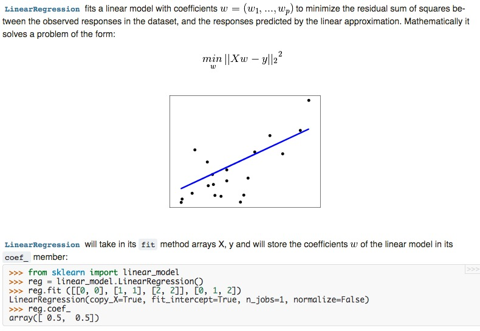

**Purpose**: This document serves as a mutable blueprint for how [articles that are oriented towards data science on Real Python](https://realpython.com/blog/categories/data-science/) should "look and feel."

## General Concepts

1. **Have a strong preference for writing about "evergreen concepts."**  Several areas of data science are receiving a lot of attention and evolving rapidly, with what was in vogue a year ago being largely defunct today.  For the sake of producing articles that have longevity, focus on the "core" libraries that have staying power and form a foundation for data science with Python.  If you're going to write on a "fringe" or up-and-coming tool but untested tool such as the Python interface to [Tensor Comprehensions](https://research.fb.com/announcing-tensor-comprehensions/) (whenever that comes out), have a very strong motivation for doing so.
2. Real Python is a Python site, not a machine-learning site.  While we want to highlight the mathematical underpinnings of a certain technique, **the focus should be on the Python implementation of a data science concept.**
    - Like everywhere else on realpython.com, try to stress clean, production-quality, PEP8-compliant code.  The code should be the focus of the article, not just a "means to an end."

## What is Data Science?

"Data science" is just about as broad of a term as they come.  It may be easiest to describe what it is by listing its more concrete components:

1. **Data exploration & analysis**.
    - Included here: Pandas; NumPy; SciPy; a helping hand from Python's Standard Library.
2. **Data visualization**.  A pretty self-explanatory name.  Taking data and turning it into something colorful.
    - Included here: Matplotlib; Seaborn; Datashader; [others](https://matplotlib.org/thirdpartypackages/index.html).
3. **Classical machine learning**.  Conceptually, we could define this as any supervised or unsupervised learning task that is not deep learning (see below).  Scikit-learn is far-and-away the go-to tool for implementing classification, regression, clustering, and dimensionality reduction, while StatsModels is less actively developed but still has a number of useful features.
    - Included here: Scikit-Learn, StatsModels.
4. **Deep learning**.  This is a subset of machine learning that is seeing a renaissance, and is commonly implemented with Keras, among other libraries.  It has seen monumental improvements over the last ~5 years, such as [AlexNet](https://en.wikipedia.org/wiki/AlexNet) in 2012, which was the first design to incorporate consecutive convolutional layers.
    - Included here: Keras.  (Significantly better-documented and stable than it handful of competitors, such as Caffe.)
5. **Data storage and big data frameworks**.  Big data is best defined as data that is either literally too large to reside on a single machine, or can't be processed in the absence of a distributed environment.  The Python bindings to Apache technologies play heavily here.
    - Apache Spark; Apache Hadoop; HDFS; Dask; h5py/pytables.
6. **Odds and ends**.  This could include subtopics such as natural language processing&ast;, and image manipulation with libraries such as OpenCV.
    - Included here: nltk; Spacy; OpenCV/cv2; scikit-image;

\* To be specific, recognition of speech itself would likely fall under machine learning/deep learning.  However, the preprocessing of text and speech with tools such as NLTK could occupy its own place.

## Difficulty Level & Awareness of Audience

Data science is a **vast** field and one that can get ["very mathy, very quickly."](http://w.svms.org/training/BOGV92.pdf)

As mentioned above, Real Python is a Python site, not a machine-learning site.  Jason Brownlee's [Machine Learning Mastery](https://machinelearningmastery.com/blog/) blog is a great example of the alternate case; it's very well-written, but some posts contain zero lines of code.  While we don't want to shy away from touching on the mathematical underpinnings of a concept, it is better to link the reader to more in-depth resources and let them have those at their disposal.

A great frame of reference in terms of a "difficulty level" to shoot for across the body of the article is Scikit-Learn's [User Guide](http://scikit-learn.org/stable/user_guide.html).  It doesn't shy away from the math, but puts the focus on the code.  (Although, articles should take a much friendlier tone; we're writing blog posts, not technical documentation.)

What would generally constitute off-topic material?  **Multi-line mathematical proofs** are certainly a candidate, as are math concepts that would likely not be taught except at the graduate or PhD level.

That said, having a generalized data science **resources page** broken out by subtopic wouldn't be a bad idea.
